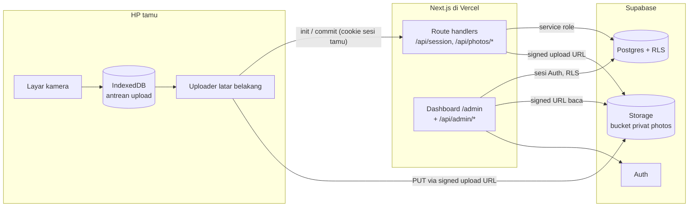
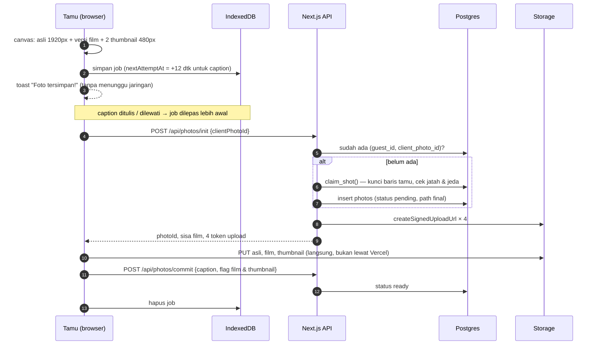
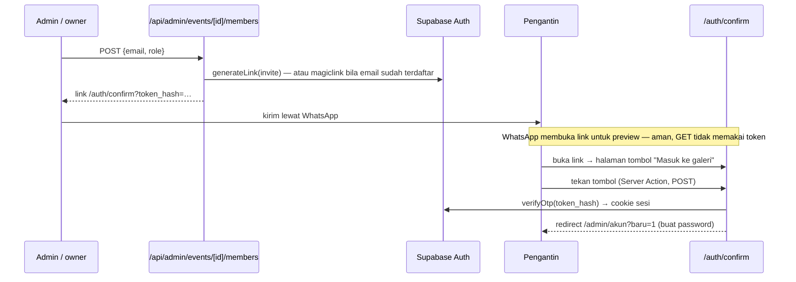

# Arsitektur

## Gambaran besar



Tiga prinsip yang membentuk semuanya:

1. **Tamu tidak pernah memegang kunci yang bisa membaca data.** Publishable key di
   browser tidak punya satu pun policy baca. Semua tulis tamu lewat route handler
   yang memvalidasi cookie sesi, lalu memakai secret key di server.
2. **Menjepret tidak pernah menunggu jaringan.** Foto masuk IndexedDB lebih dulu;
   jaringan diurus uploader di latar belakang.
3. **Aturan penting ditegakkan database, bukan UI.** Jatah film, hak akses acara,
   dan idempotensi upload ada di Postgres.

## Alur tamu

### Masuk

1. QR membuka `/e/[slug]?t=Meja 5`.
2. Server membaca acara dan status jendela waktunya (`lib/util/event-window.ts`):
   `open`, `belum_dibuka`, `sudah_tutup`, atau `nonaktif`.
3. Tamu mengetik nama → `POST /api/session`.
   - Tamu diidentifikasi sebagai **(acara, nama ternormalisasi, device_id)**.
     `device_id` adalah UUID di `localStorage`, jadi scan ulang dari HP yang sama
     melanjutkan rol film yang sama.
   - Server membuat baris `guest_sessions` dan menyimpan **hash** token; token
     mentah hanya ada di cookie `dc_session` (httpOnly, Secure, 18 jam).
4. Tamu yang sudah punya sesi valid langsung dialihkan ke `/kamera`.

### Menjepret dan mengunggah



Detail yang penting:

| Perilaku | Implementasi |
|---|---|
| Retry tidak menggandakan foto / jatah | `unique (guest_id, client_photo_id)`; `init` untuk id yang sama mengembalikan foto yang ada tanpa `claim_shot` |
| Upload besar tidak lewat Vercel | Signed upload URL → browser PUT langsung ke Storage |
| Sinyal putus | Backoff eksponensial 2 dtk → 60 dtk + jitter, resume saat `online` / tab kembali terlihat, maks 12 percobaan |
| Dua upload paralel tabrakan rate limit | `TERLALU_CEPAT` dicoba ulang 700 ms tanpa dihitung gagal |
| Film habis / sesi mati / acara tutup | Job dibuang (percobaan ulang tidak akan pernah berhasil) |
| Versi film / thumbnail gagal | Foto asli tetap tersimpan; flag `filtered_path` / `has_thumb` menyesuaikan |
| Counter film | Hitungan lokal dipotong saat menjepret; nilai server hanya boleh mengoreksi **ke bawah** |

### Kamera (`lib/camera/`)

| Masalah di HP | Penanganan |
|---|---|
| iOS mewajibkan gesture | Stream hanya diminta setelah tombol "Buka kamera" ditekan; `AudioContext` di-unlock di gesture yang sama |
| `<video>` fullscreen di iOS | `playsInline muted autoPlay` + `play()` eksplisit |
| Kamera HP murah menolak resolusi | Tangga constraint: 1920×1080 → tanpa resolusi → `video: true` |
| Viewfinder hitam setelah pindah app | Stream dipulihkan saat `visibilitychange`; dimatikan saat `pagehide` |
| `<video>` baru dirender setelah stream siap | Stream dipasang lewat *callback ref* saat elemen muncul |
| Browser dalam aplikasi (Instagram, WhatsApp) | Deteksi user agent → banner "Buka di Safari/Chrome" + fallback input galeri |
| Flash | Android: `torch` constraint. iOS (tanpa torch API): layar putih sesaat |

Versi film (`filmFilter.ts`) dibuat di canvas: filter CSS per preset, light leak
acak (±35% foto), vignette, tile grain `overlay`, dan date stamp oranye.

## Alur dashboard

### Peran

| Peran | Sumber | Lihat & unduh | Sembunyikan foto, ubah pengaturan | Undang / cabut anggota | Buat & hapus acara |
|---|---|---|---|---|---|
| Admin GuestPro | `platform_admins` | semua acara | ✅ | ✅ | ✅ |
| `owner` (pengantin) | `event_members` | acaranya | ✅ | ✅ | — |
| `editor` (WO) | `event_members` | acaranya | ✅ | — | — |
| `viewer` | `event_members` | acaranya | — | — | — |

Setiap halaman dan API admin memanggil `getEventAccess()` (`lib/admin/access.ts`),
yang membaca acara **lewat client ber-RLS**. Kalau RLS tidak mengizinkan, acara
tidak ditemukan — pengecekan di kode hanya lapisan kedua.

### Undangan



Dua keputusan di sini:

- **Link, bukan email.** Mailer bawaan Supabase hanya mengirim ke anggota tim
  project. Mengandalkannya berarti undangan tidak pernah sampai.
- **Token ditukar saat tombol ditekan, bukan saat halaman dibuka.** Preview link
  WhatsApp, pemindai email, dan prerender browser membuka URL lebih dulu. Versi
  awal menukar token pada GET dan tokennya habis dipakai bot (terbukti dari data:
  token terpakai 7 detik setelah dibuat).

### Galeri, ZIP, dan hapus acara

- Galeri memuat 48 foto per halaman, kursor `created_at`. Semua path (penuh +
  thumbnail) ditandatangani dalam satu panggilan `createSignedUrls` (TTL 1 jam).
- ZIP distream dengan `archiver` mode *store* — JPEG tidak dikompres ulang — dan
  dipecah per 300 foto supaya satu permintaan tidak menembus batas waktu fungsi.
- Hapus acara: tutup kamera → hapus file per batch 1000 (daftar file dari fungsi
  SQL `event_storage_objects`) → hapus baris acara (cascade). File dihapus lebih
  dulu supaya proses yang terputus bisa diulang.

## Struktur folder

```
app/
  e/[slug]/                 halaman tamu: nama → kamera → selesai
  admin/                    dashboard (dilindungi proxy.ts)
    acara-baru/             buat acara (admin GuestPro)
    [eventId]/              galeri
    [eventId]/pengaturan/   detail acara, undangan, hapus acara
    [eventId]/qr/           QR per meja
    akun/                   password
  auth/confirm/             halaman link undangan + Server Action
  api/session/              sesi tamu
  api/photos/{init,commit}/ upload tamu
  api/admin/events/…        CRUD acara, anggota, foto, ZIP
components/
  camera/                   UI kamera tamu
  guest/                    form nama
  admin/                    galeri, form, panel anggota, hapus acara
lib/
  camera/                   getUserMedia, capture, filter film, torch, suara
  upload/                   antrean IndexedDB + uploader
  supabase/                 client browser, server (RLS), admin (service role)
  admin/                    cek akses, validasi input acara, link undangan
  guest-session.ts          buat & validasi cookie sesi tamu
  env.ts                    env var + konstanta operasional
proxy.ts                    refresh sesi Supabase, lindungi /admin/*
supabase/migrations/        skema database berurutan
```

> Next.js 16 mengganti `middleware.ts` dengan `proxy.ts`. Baca
> `node_modules/next/dist/docs/` sebelum menulis kode — banyak API berbeda dari
> versi sebelumnya (lihat `AGENTS.md`).

## Konstanta yang bisa disetel

| Konstanta | Nilai | Lokasi |
|---|---|---|
| Resolusi & kualitas foto | 1920px, q0.82 | `lib/camera/capture.ts` |
| Thumbnail | 480px, q0.72 | `lib/camera/capture.ts` |
| Cooldown shutter (client) | 1500 ms | `components/camera/CameraView.tsx` |
| Jeda klaim film (server) | 400 ms | `MIN_SHOT_INTERVAL_MS`, `lib/env.ts` |
| Tahanan caption | 12 dtk | `CAPTION_GRACE_MS`, `lib/upload/queue.ts` |
| Upload paralel / backoff / percobaan | 2 / 2–60 dtk / 12 | `lib/upload/uploader.ts` |
| Umur sesi tamu | 18 jam | `GUEST_SESSION_HOURS`, `lib/env.ts` |
| Foto per halaman galeri | 48 | `GALLERY_PAGE_SIZE` |
| Foto per ZIP | 300 | `ZIP_PART_SIZE` |
| Umur signed URL galeri | 1 jam | `SIGNED_URL_TTL_SECONDS` |
| Default jatah film | 27 | kolom `events.film_limit` |

## Keterbatasan yang diketahui

| Keterbatasan | Dampak | Mitigasi saat ini |
|---|---|---|
| **Kegagalan saat offline dihitung sebagai percobaan.** Setelah 12 kali (±7–9 menit dengan halaman terbuka) job dibuang | Tamu yang offline lebih lama dari itu **kehilangan foto tanpa peringatan** | Belum ada — perlu perbaikan: jangan hitung percobaan saat `navigator.onLine === false` dan jangan pernah membuang job karena error jaringan |
| Job antrean dibuang bila sesi kedaluwarsa (18 jam) atau acara sudah ditutup | Foto tamu yang offline lama bisa hilang | Tutup kamera 30–60 menit setelah acara selesai ([OPERASIONAL.md](OPERASIONAL.md)) |
| Signed URL galeri berubah tiap muat | Browser tidak meng-cache gambar antar kunjungan | Thumbnail kecil membuat muat ulang tetap cepat |
| Link undangan kedaluwarsa (bawaan 1 jam) | Pengantin yang telat membuka harus minta link baru | Naikkan OTP expiry ke 24 jam; tombol "Link baru" |
| Membuat link baru menghanguskan link lama untuk email yang sama | Link pertama di WhatsApp tidak berlaku | Dijelaskan di panel undangan |
| Mengubah slug acara | QR yang sudah dicetak mati | Peringatan di form pengaturan |
| Foto sebelum fitur thumbnail | Grid memuat file penuh | Otomatis fallback |
