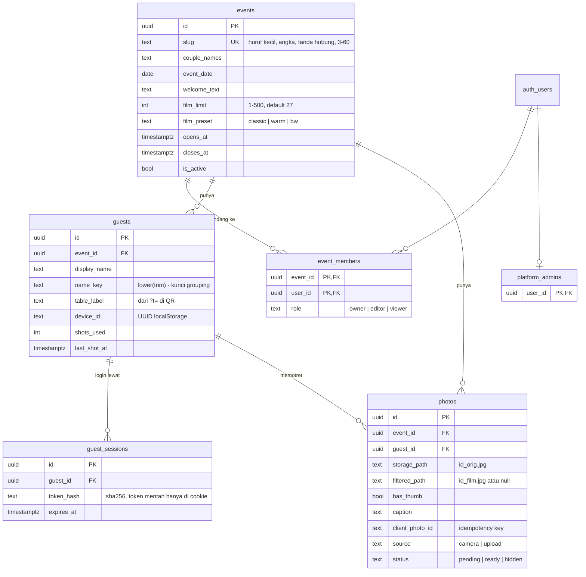

# Database & Storage

Postgres dan Storage di Supabase. Semua skema ada di `supabase/migrations/`,
diterapkan berurutan dengan `npm run db:push`.

## Diagram relasi



Semua foreign key memakai `on delete cascade`: menghapus acara menghapus tamu,
sesi, foto, dan keanggotaan. **File di Storage tidak ikut terhapus oleh cascade**
— itu tugas endpoint hapus acara.

## Tabel

### `events`
Satu baris per pernikahan. `slug` tercetak di QR, jadi constraint
`events_slug_format` mencegah karakter yang tidak aman di URL.

Jendela kamera dihitung di `lib/util/event-window.ts`:
`is_active = false` → nonaktif; sebelum `opens_at` → belum dibuka; setelah
`closes_at` → sudah tutup. Kolom waktu yang kosong berarti tidak dibatasi.

### `guests`
Unik per **(event_id, name_key, device_id)**. Dua orang bernama sama di HP
berbeda adalah dua tamu, tapi tampil sebagai satu grup di dashboard karena
dikelompokkan per `name_key`. `shots_used` dan `last_shot_at` hanya diubah oleh
`claim_shot()`.

### `guest_sessions`
Pengganti Supabase Auth untuk tamu. Cookie berisi `<session_id>.<token>`;
database hanya menyimpan `sha256(token)`. Tidak punya policy RLS sama sekali.

### `photos`
Baris dibuat saat `init` (status `pending`), sebelum file diunggah. Artinya
setiap file di Storage punya baris — penting untuk pembersihan.
`status = hidden` disembunyikan dari galeri dan ZIP tapi filenya tetap ada.

### `event_members` & `platform_admins`
Lihat tabel peran di [ARSITEKTUR.md](ARSITEKTUR.md#peran). Keduanya hanya ditulis
lewat service role (endpoint anggota, atau SQL manual untuk admin platform).

## Fungsi

| Fungsi | Jenis | Dipakai oleh | Fungsi |
|---|---|---|---|
| `claim_shot(p_guest, p_min_interval_ms)` | security definer | `/api/photos/init` | Mengunci baris tamu, menolak bila film habis (`FILM_HABIS`) atau terlalu cepat (`TERLALU_CEPAT`), lalu menaikkan `shots_used`. Mengembalikan `remaining`, `roll_limit` |
| `is_event_member(p_event)` | security definer | fungsi lain | User login adalah anggota acara (peran apa pun) |
| `is_platform_admin()` | security definer | RLS, `getAdminContext` | User login ada di `platform_admins` |
| `can_view_event(p_event)` | security definer | RLS select | Admin platform **atau** anggota |
| `can_manage_event(p_event)` | security definer | RLS update, API | Admin platform, `owner`, atau `editor` |
| `can_manage_members(p_event)` | security definer | API anggota | Admin platform atau `owner` |
| `event_guest_summary(p_event)` | security **invoker** | sidebar galeri | Nama tamu + jumlah foto `ready`, digabung per `name_key`. Invoker supaya RLS tetap berlaku |
| `event_storage_objects(p_event)` | security definer | hapus acara | Daftar path file acara dari `storage.objects`. Execute **hanya** untuk `service_role` |

Fungsi `security definer` memakai `set search_path` eksplisit supaya tidak bisa
dibajak lewat objek dengan nama sama di schema lain.

## Row Level Security

RLS aktif di semua tabel. Tidak ada satu pun policy untuk role `anon`.

| Tabel | select | insert | update | delete |
|---|---|---|---|---|
| `events` | `can_view_event(id)` | `is_platform_admin()` | `can_manage_event(id)` | — (service role) |
| `event_members` | diri sendiri atau `can_view_event` | — | — | — |
| `platform_admins` | diri sendiri | — | — | — |
| `guests` | `can_view_event` | — | — | — |
| `guest_sessions` | — | — | — | — |
| `photos` | `can_view_event` | — | `can_manage_event` | `can_manage_event` |

"—" berarti tidak ada policy: hanya service role (route handler) yang bisa.

## Storage

Bucket `photos`: **privat**, maks 8 MB per file, hanya `image/jpeg`, tanpa policy
publik.

```
photos/
  {event_id}/
    {guest_id}/
      {photo_id}_orig.jpg         1920px, ±400 KB
      {photo_id}_film.jpg         versi film
      {photo_id}_orig_thumb.jpg   480px, ±30 KB (bila has_thumb)
      {photo_id}_film_thumb.jpg
```

- **Tulis:** tamu memakai signed upload URL yang dibuat server per file.
- **Baca:** server membuat signed URL 1 jam untuk dashboard, atau mengunduh
  langsung untuk ZIP.
- Path thumbnail diturunkan dari path utama (`.jpg` → `_thumb.jpg`), jadi tidak
  butuh kolom tambahan.
- Jangan menghapus file dengan `delete from storage.objects` — itu hanya
  menghapus metadata, file fisiknya tertinggal. Pakai Storage API.

## Migrasi

| File | Isi |
|---|---|
| `20260916000001_init.sql` | Tabel inti |
| `20260916000002_functions.sql` | `claim_shot`, `is_event_member`, `event_guest_summary` |
| `20260916000003_rls.sql` | RLS awal + bucket `photos` |
| `20260916000004_platform_admins.sql` | Peran platform, helper izin, policy baru, constraint slug |
| `20260916000005_photo_thumbs.sql` | Kolom `photos.has_thumb` |
| `20260916000006_event_storage_objects.sql` | Fungsi daftar file per acara |

## Query berguna

```sql
-- Ringkasan per acara
select e.slug, e.couple_names, e.is_active,
       count(distinct g.id) as tamu,
       count(p.id) filter (where p.status = 'ready') as foto,
       count(p.id) filter (where p.status = 'pending') as foto_pending,
       pg_size_pretty(coalesce(sum(p.bytes), 0)) as ukuran_asli
from public.events e
left join public.guests g on g.event_id = e.id
left join public.photos p on p.guest_id = g.id
group by e.id order by e.created_at desc;

-- Foto yang tertahan pending lebih dari 1 jam (upload tamu tidak selesai)
select e.slug, count(*) from public.photos p join public.events e on e.id = p.event_id
where p.status = 'pending' and p.created_at < now() - interval '1 hour'
group by e.slug;

-- Kesehatan data: harus semuanya 0
select
  (select count(*) from storage.objects o where o.bucket_id = 'photos'
     and not exists (select 1 from public.events e where o.name like e.id::text || '/%')) as file_yatim,
  (select count(*) from public.photos p
     where not exists (select 1 from public.events e where e.id = p.event_id)) as foto_yatim;

-- Total pemakaian storage
select pg_size_pretty(sum((metadata->>'size')::bigint)) from storage.objects where bucket_id = 'photos';

-- Siapa saja anggota sebuah acara
select u.email, m.role, u.last_sign_in_at
from public.event_members m join auth.users u on u.id = m.user_id
join public.events e on e.id = m.event_id where e.slug = 'kevin-sarah';
```

Dari terminal proyek: `npx supabase db query --linked "<sql>"`.
