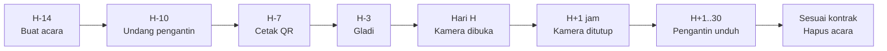

# Panduan Operasional — Admin GuestPro

Runbook untuk menjalankan satu acara dari persiapan sampai arsip, plus
penanganan masalah yang paling sering muncul.

## Siklus satu acara



### H-14 · Buat acara

`/admin` → **+ Acara baru**

| Field | Saran |
|---|---|
| Nama pengantin | Seperti tertulis di undangan, misalnya `Kevin & Sarah` |
| Alamat untuk tamu | Pendek & mudah dieja: `kevin-sarah`. **Jangan diubah setelah QR dicetak** |
| Jatah foto per tamu | 27 (klasik), 15 untuk acara >500 tamu agar storage terkendali |
| Kamera dibuka | 30 menit sebelum resepsi |
| Kamera ditutup | **Kosongkan dulu**; tutup manual setelah acara (lihat H+1 jam) |
| Gaya versi film | Diskusikan dengan pengantin — `classic` aman untuk semua tema |
| Pesan sambutan | Personal dari pengantin, maksimal 2 kalimat |

### H-10 · Undang pengantin

Pengaturan & undangan → email pengantin → peran **Pengantin** → **Buat link
undangan** → **Kirim lewat WhatsApp**.

- Kirimkan juga [PANDUAN-PENGANTIN.md](PANDUAN-PENGANTIN.md).
- Cek kolom daftar anggota: tulisan *belum membuka undangan* hilang setelah mereka masuk.
- WO yang perlu mengatur jadwal → peran **Pengelola (WO)**. Keluarga/fotografer → **Lihat saja**.

### H-7 · Cetak QR

Galeri acara → **Cetak QR meja** → isi jumlah meja → cetak dari browser (A4, 2 kolom).

- Setiap QR membawa label meja (`?t=Meja 5`), tampil di dashboard sebagai info tamu.
- Pastikan `NEXT_PUBLIC_SITE_URL` di Vercel adalah domain produksi **sebelum**
  mencetak; alamat di QR tidak bisa diubah setelah dicetak.
- Scan satu QR hasil cetak dengan HP sebelum mencetak semuanya.

### H-3 · Gladi

Pakai acara uji terpisah, **bukan** acara pengantin (jatah film terpakai).

- [ ] 3–4 HP berbeda: minimal 1 iPhone Safari, 1 Android Chrome, 1 HP kelas bawah
- [ ] Scan QR → nama → kamera menyala → jepret 3×
- [ ] Buka link dari chat WhatsApp → muncul banner "Buka di Safari/Chrome"
- [ ] Mode pesawat → jepret 2× → muncul "offline · 2 tersimpan di HP" → tunggu beberapa menit → matikan mode pesawat → foto masuk tanpa dobel
- [ ] Foto muncul di galeri dengan nama yang benar, toggle Asli/Film jalan
- [ ] Unduh ZIP dan buka isinya
- [ ] Cek sinyal di lokasi acara bila memungkinkan
- [ ] Hapus acara uji setelahnya

### Hari H

**30 menit sebelum resepsi**
- [ ] Buka `/e/<slug>` dari HP: form nama tampil (bukan "belum dibuka")
- [ ] Jepret 1 foto uji → muncul di galeri → sembunyikan
- [ ] Supabase & Vercel status normal ([status.supabase.com](https://status.supabase.com), [vercel-status.com](https://www.vercel-status.com))

**Selama acara** — pantau sesekali:
```sql
select count(distinct g.id) filter (where p.id is not null) as tamu_memotret,
       count(p.id) filter (where p.status = 'ready') as foto_masuk,
       count(p.id) filter (where p.status = 'pending'
                           and p.created_at < now() - interval '15 minutes') as pending_lama
from public.guests g
left join public.photos p on p.guest_id = g.id
where g.event_id = (select id from public.events where slug = 'kevin-sarah');
```
`pending_lama` yang terus naik → tamu kesulitan mengunggah (sinyal gedung).

### H+1 jam · Tutup kamera

Pengaturan → hapus centang **Kamera aktif** (atau isi *Kamera ditutup*).

> **Jangan menutup kamera tepat saat acara usai.** Foto yang masih mengantre di
> HP tamu yang offline akan **dibuang** begitu kamera tertutup. Beri jeda 30–60
> menit agar antrean sempat terkirim saat tamu keluar gedung dan mendapat sinyal.

### H+1 sampai H+30 · Pengantin mengunduh

- Pengantin mengunduh sendiri lewat dashboard.
- Acara besar (>300 foto) terbagi beberapa ZIP — ingatkan untuk mengunduh semua bagian.
- Foto yang disembunyikan tidak ikut ZIP.

### Sesuai kontrak · Hapus acara

Pengaturan → **Hapus acara** → ketik alamat acara → **Hapus acara permanen**.

- Pastikan pengantin **sudah mengonfirmasi** semua ZIP terunduh.
- Menghapus membebaskan storage; tidak bisa dibatalkan.
- Bila gagal di tengah jalan, tekan hapus lagi — proses aman diulang.

## Troubleshooting

### Tamu

| Laporan | Kemungkinan penyebab | Tindakan |
|---|---|---|
| "Kameranya hitam" | Izin kamera ditolak, atau dibuka dari browser dalam aplikasi | Buka di Safari/Chrome; izinkan kamera (petunjuk muncul di layar) |
| "Izin kamera ditolak dan tidak muncul lagi" | Browser mengingat penolakan | iPhone: ikon «aA» → Pengaturan Situs → Kamera. Android: ikon gembok → Izin → Kamera. Lalu muat ulang |
| "Kamera sedang dipakai aplikasi lain" | Video call / kamera bawaan terbuka | Tutup aplikasi itu, tekan Coba lagi |
| Tidak bisa sama sekali | HP/browser sangat lama | Tombol **Kamera bermasalah? Kirim dari galeri** |
| "Kamera belum dibuka / sudah ditutup" | Di luar jadwal atau nonaktif | Cek jam di Pengaturan (zona waktu perangkat admin) |
| "Rol film habis" padahal baru sedikit | Tamu scan ulang dari HP yang sama dengan nama sama → melanjutkan rol lama | Sesuai desain. Jika perlu, naikkan jatah film acara |
| "Menunggu" / "offline · N tersimpan di HP" tidak berkurang | Sinyal lemah atau hilang | Foto aman di HP. Biarkan halaman terbuka, atau buka lagi link acara setelah dapat sinyal — terkirim otomatis |
| Foto tidak muncul di galeri | Masih mengantre di HP tamu, atau terbuang (lihat [keterbatasan](ARSITEKTUR.md#keterbatasan-yang-diketahui)) | Cek `pending_lama`; minta tamu membuka lagi halaman kamera |

### Pengantin / admin

| Laporan | Penyebab | Tindakan |
|---|---|---|
| "Link masuk sudah kedaluwarsa" | Lewat masa berlaku, sudah dipakai, atau link lebih baru sudah dibuat | Pengaturan → **Link baru** → kirim ulang |
| "Belum ada acara yang terhubung ke akun ini" | Masuk dengan email berbeda dari yang diundang | Cek email di halaman Akun; undang email yang benar |
| Tidak melihat tombol Pengaturan | Peran **Lihat saja** | Ubah peran: undang ulang email yang sama dengan peran baru |
| Unduh ZIP berhenti / gagal | Koneksi terputus atau bagian terlalu besar | Unduh ulang bagian itu; atau unduh per tamu |
| Lupa password | — | Admin: Pengaturan → **Link baru** → masuk → Akun → ganti password |
| QR mengarah ke alamat salah | `NEXT_PUBLIC_SITE_URL` salah, atau slug diubah | Perbaiki env & redeploy, atau kembalikan slug; cetak ulang bila perlu |

### Server

| Gejala | Cek | Tindakan |
|---|---|---|
| Semua halaman tamu error 500 | Vercel → Logs; status Supabase | Env var, kunci diputar tanpa redeploy, atau Supabase down |
| Upload gagal massal | Supabase → Storage kuota; Logs | Storage penuh → upgrade/hapus acara lama |
| Dashboard lambat | Banyak foto lama tanpa thumbnail | Wajar untuk foto sebelum fitur thumbnail |

## Kapasitas & biaya

Perkiraan ukuran per jepretan: asli ±400 KB + film ±400–500 KB (grain membuat
JPEG sedikit lebih besar) + 2 thumbnail ±60 KB ≈ **0,9 MB**. Angka nyata per acara
bisa dicek dengan query di bawah.

| Tamu memotret | Jatah | Rata-rata terpakai | Foto | Storage |
|---|---|---|---|---|
| 150 | 27 | 40% | ±1.600 | ±1,5 GB |
| 300 | 27 | 40% | ±3.200 | ±2,9 GB |
| 300 | 27 | 100% (terburuk) | 8.100 | ±7,3 GB |
| 600 | 15 | 50% | ±4.500 | ±4 GB |

- Supabase Pro: 100 GB storage termasuk paket → ±25–35 acara aktif sekaligus.
  Hapus acara lama sesuai kontrak agar tetap di bawah kuota.
- Egress (unduhan) juga dihitung: satu pengantin mengunduh semua ZIP ≈ ukuran asli acara.

Cek pemakaian:
```sql
select pg_size_pretty(sum((metadata->>'size')::bigint)) as total from storage.objects where bucket_id = 'photos';
```

## Tugas administrasi (SQL)

Jalankan di Supabase SQL Editor atau `npx supabase db query --linked "…"`.

```sql
-- Tambah admin GuestPro (user harus sudah ada di Authentication → Users)
insert into public.platform_admins (user_id)
select id from auth.users where email = 'staf@guestpro.id';

-- Cabut admin GuestPro
delete from public.platform_admins
where user_id = (select id from auth.users where email = 'staf@guestpro.id');

-- Beri tamu tertentu tambahan jatah film (misalnya pengantin sendiri)
update public.guests set shots_used = greatest(shots_used - 10, 0)
where event_id = (select id from public.events where slug = 'kevin-sarah')
  and name_key = 'dinda';

-- Tampilkan kembali semua foto yang disembunyikan di satu acara
update public.photos set status = 'ready'
where status = 'hidden' and event_id = (select id from public.events where slug = 'kevin-sarah');
```
